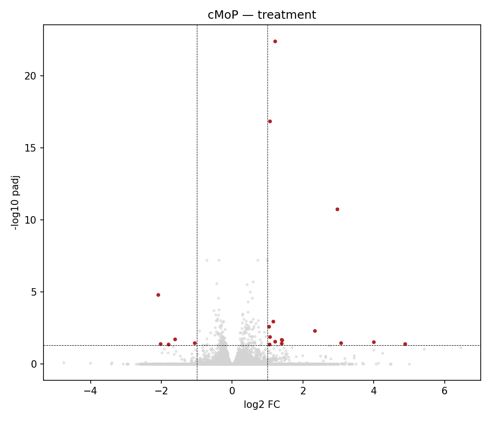

% m6A perturbation in mouse bone marrow — preliminary single-cell figures
% Charles project — internal, exploratory
% Eduardo Menotti · 2026-06-04

---

**Preliminary analyses — internal discussion only.** Mouse bone-marrow scRNA-seq, ~42,000 cells, 2 × 2 design: genotype (WT, Mutant) × treatment (DMSO vehicle, STM2457 METTL3 inhibitor), two biological donors (paired blocking factor; WT and Mutant separated *in silico*). Cell types use the canonical `cell_type` annotation (HemaScribe lineage calls + manual marker validation, 32 types). Composition was modelled with scCODA, differential expression with pseudobulk PyDESeq2 (`~ donor + genotype + treatment`), and pathway activity with decoupler ULM on the DESeq2 statistic against MSigDB Hallmark/Reactome/KEGG. The genotype contrast is Mutant relative to WT; the treatment contrast is STM relative to DMSO. Figures are descriptive; see caveats at the end.

---

![**Figure 2. Cell-type composition.** (A) Per-sample proportion of each cell type on a log scale, coloured by condition (two donors per condition). (B) Mutant-vs-WT log2 fold-change per cell type, pooled over treatment; filled points are flagged credible by scCODA in the genotype contrast, hollow points are not. The stem/progenitor populations HSC and STHSC are lower in Mutant; Monocyte is higher in Mutant. The largest lymphoid fold-changes (B cell, T cell, Pro/Pre-B) coincide with populations captured in only a subset of samples and partly reflect donor/capture differences rather than genotype.](figures/fig2_composition.png)

---

## Caveats

- Exploratory, hypothesis-generating analyses from a compact pilot dataset — intended to surface directions for follow-up, not to be confirmatory.
- With two donors per group, effect sizes (especially for the treatment contrast) are best read qualitatively rather than as precise estimates.
- The lymphoid compartment is unevenly represented across samples, so lymphoid composition changes are not interpreted here.
- Results for the rarest populations (basophils, megakaryocytes) rest on small numbers and are tentative; scCODA credibility indicates direction, not a calibrated effect size.

*Reproducible from `results/18_composition/final_annotation`, `results/19_pseudobulk_deg/final_annotation`, and `results/20_pathway_activity/final_annotation`. Code: `pipeline/scripts/18_composition_sccoda.py`, `19_pseudobulk_deg.py`, `20_pathway_activity.py`; figures `report/make_fig1_umap.py`, `report/make_fig2_composition.py`. Canonical annotation: `21z_finalize_annotation.py`, `22_clean_annotation_columns.py`. Branch `feat/composition-pseudobulk`.*
